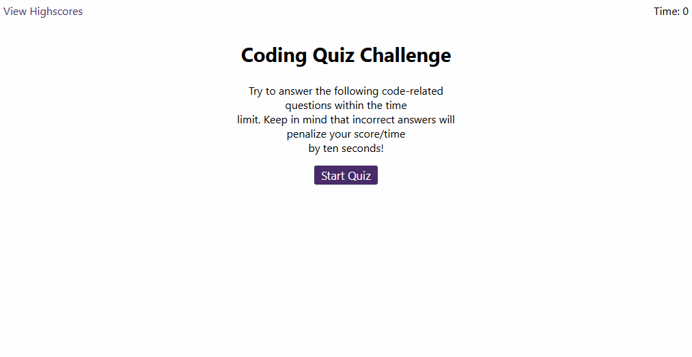

# Timed-Interactive-Quiz

## Description

This program presents the user with an interactive quiz that comes with the condition of a timer that decided their score. The quiz questions and answers are easily defined in the code, as well as the value of the timer, so that either can be changed to suit the needs of the quiz master. Once the user has completed the quiz, they can enter their initials to be saved in their browser's localStorage and then pulled from to display a list of highscores.

This program utilizes different aspects of JavaScript such as: timers, classes, functions, accessing localStorage, array and object methods, and page events.

## Link

This is a link to the project hosted on GitHub Pages: [https://jcherwin.github.io/Timed-Interactive-Quiz/](https://jcherwin.github.io/Timed-Interactive-Quiz/)

## Usage

This image is an example of what to expect when viewing the complete webpage.

